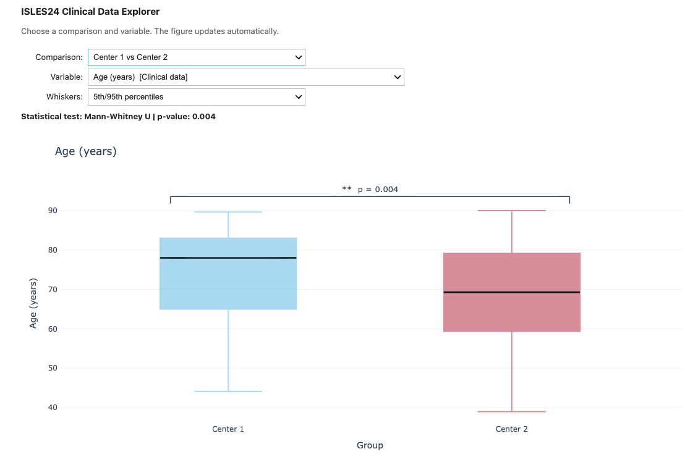

# ISLES'24: Ischemic Stroke Lesion Segmentation Challenge 2024

<p align="center">
  
</p>

ISLES'24 focuses on the prediction of **final stroke infarction from acute multimodal imaging and clinical data**. The challenge provides a clinically realistic benchmark combining NCCT, CTA, CTP, perfusion maps, and structured clinical information.

## Challenge task

The goal of ISLES'24 is to evaluate automated methods for **final stroke infarct segmentation**.

Participants develop algorithms that predict the final infarct from pre-interventional acute stroke data, including:

- non-contrast CT (**NCCT**);
- CT angiography (**CTA**);
- perfusion CT (**CTP**) and derived perfusion maps;
- clinical tabular data.

Algorithms are submitted as Docker containers and evaluated automatically on a hidden test dataset.

## Data

The ISLES'24 dataset is available after registration on the [challenge website](https://isles-24.grand-challenge.org/).

The data follow the **Brain Imaging Data Structure (BIDS)** convention. A single case is organized approximately as follows:

```text
+-- rawdata
|   +-- sub-strokecase0001
|       +-- ses-0001
|           +-- perfusion-maps
|           |   +-- sub-strokecase0001_ses-0001_tmax.nii.gz
|           |   +-- sub-strokecase0001_ses-0001_mtt.nii.gz
|           |   +-- sub-strokecase0001_ses-0001_cbf.nii.gz
|           |   +-- sub-strokecase0001_ses-0001_cbv.nii.gz
|           +-- sub-strokecase0001_ses-0001_ncct.nii.gz
|           +-- sub-strokecase0001_ses-0001_cta.nii.gz
|           +-- sub-strokecase0001_ses-0001_ctp.nii.gz
|       +-- ses-0002
|           +-- sub-strokecase0001_ses-0002_dwi.nii.gz
|           +-- sub-strokecase0001_ses-0002_adc.nii.gz
|
+-- derivatives
|   +-- sub-strokecase0001
|       +-- ses-0001
|           +-- perfusion-maps
|           |   +-- sub-strokecase0001_ses-0001_space-ncct_tmax.nii.gz
|           |   +-- sub-strokecase0001_ses-0001_space-ncct_mtt.nii.gz
|           |   +-- sub-strokecase0001_ses-0001_space-ncct_cbf.nii.gz
|           |   +-- sub-strokecase0001_ses-0001_space-ncct_cbv.nii.gz
|           +-- sub-strokecase0001_ses-0001_space-ncct_cta.nii.gz
|           +-- sub-strokecase0001_ses-0001_space-ncct_ctp.nii.gz
|       +-- ses-0002
|           +-- sub-strokecase0001_ses-0002_lesion-msk.nii.gz
|
+-- phenotype
    +-- ses-0001
    |   +-- sub-strokecase0001_ses-0001_demographic_baseline.csv
    +-- ses-0002
        +-- sub-strokecase0001_ses-0002_outcome.csv
```

More information about BIDS is available at [bids.neuroimaging.io](https://bids.neuroimaging.io/).

## Explore the clinical data

The repository includes an interactive **[ISLES'24 Clinical Data Explorer](https://github.com/ezequieldlrosa/isles24/blob/main/utils/isles24_clinical_data_explorer.ipynb)** for exploring the clinical characteristics of the challenge cohort.

<p align="center">
  
</p>

The explorer provides an interactive interface for comparing the **training and test cohorts** and patients from **Center 1 and Center 2** across continuous, categorical, and ordinal clinical variables.

Continuous variables are displayed as boxplots reconstructed from the reported summary statistics, while categorical variables are shown as grouped bar plots with percentages or counts.

For each comparison, the corresponding **statistical test and p-value** are displayed, with statistically significant differences highlighted directly in the visualization.

The summarized clinical data used by the explorer are available in [`isles24_summary.xlsx`](https://github.com/ezequieldlrosa/isles24/blob/main/isles24_summary.xlsx).

### Run the explorer

Clone the repository, install the dependencies, and launch the notebook:

```bash
git clone https://github.com/ezequieldlrosa/isles24.git
cd isles24
pip install -r requirements.txt
jupyter lab utils/isles24_clinical_data_explorer.ipynb
```

That's it. The notebook will open directly in JupyterLab.

## Performance evaluation

The evaluation utilities used by ISLES'24 are provided in [`utils/eval_utils`](https://github.com/ezequieldlrosa/isles24/tree/main/utils/eval_utils).

The challenge evaluates predictions using four complementary metrics:

- **Dice Similarity Coefficient** — voxel-wise spatial overlap;
- **Absolute Volume Difference (AVD)** — agreement in predicted infarct volume;
- **Lesion-wise F1-score** — lesion detection performance;
- **Absolute Lesion Count Difference (ALCD)** — agreement in the number of detected lesions.

For details about the challenge design and ranking procedure, see the [ISLES'24 challenge documentation](https://zenodo.org/records/10991145).

## Notebooks

Two Jupyter notebooks are provided in this repository:

| Notebook | Purpose |
|---|---|
| **[Clinical Data Explorer](https://github.com/ezequieldlrosa/isles24/blob/main/utils/isles24_clinical_data_explorer.ipynb)** | Interactive exploration of clinical characteristics, training/test subsets, centers, and statistical comparisons |
| **[Evaluation Notebook](https://github.com/ezequieldlrosa/isles24/blob/main/utils/isles24_evaluate.ipynb)** | Example workflow for loading ISLES'24 data and evaluating segmentation predictions |

## Citation

If you use the ISLES'24 dataset, challenge framework, evaluation tools, or clinical data resources, please cite:

> de la Rosa, Ezequiel, et al. **"ISLES'24: Final Infarct Prediction with Multimodal Imaging and Clinical Data. Where Do We Stand?."** *arXiv preprint arXiv:2408.10966* (2024).

```bibtex
@article{de2024isles,
  title={ISLES'24: Final Infarct Prediction with Multimodal Imaging and Clinical Data. Where Do We Stand?},
  author={de la Rosa, Ezequiel and Su, Ruisheng and Reyes, Mauricio and Riedel, Evamaria O and Baazaoui, Hakim and Wiest, Roland and Kofler, Florian and Yang, Kaiyuan and Robben, David and Mojtahedi, Mahsa and others},
  journal={arXiv preprint arXiv:2408.10966},
  year={2024}
}
```

## License

The ISLES'24 dataset is released under the **CC BY-NC (Attribution-NonCommercial)** license. Users of the ISLES'24 data must abide by the Data Usage Policy and the OPEN DATA license, following the definitions of [opendata.swiss](https://opendata.swiss/en).

The code in this repository is released under the **MIT License**.
